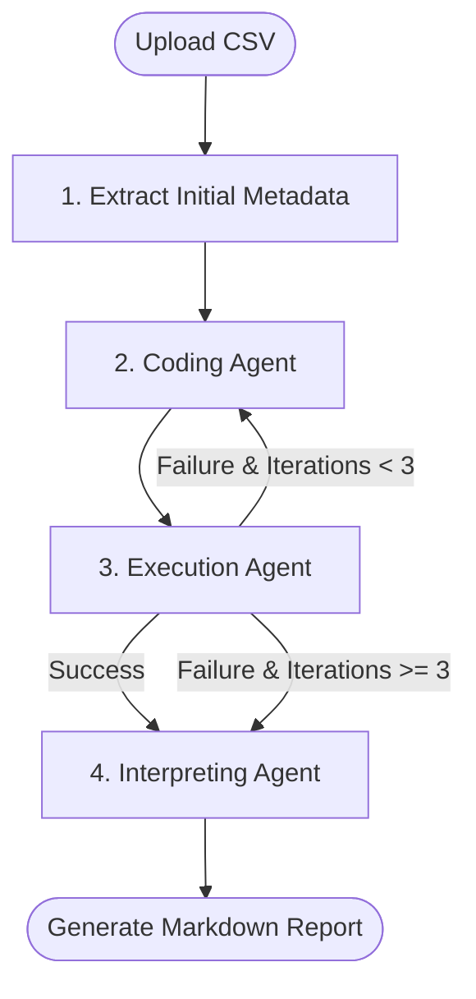

# 🤖 Agentic AI Pipeline to Automate EDA

A highly robust, multi-agent artificial intelligence pipeline that automates Exploratory Data Analysis (EDA). Built with **LangGraph**, **LangChain**, and **Streamlit**, this project dynamically generates, executes, and analyzes Python Pandas code to produce comprehensive statistical reports from any CSV dataset you provide.

---

## ✨ Key Features

- **Multi-Agent Workflow:** Utilizes a state-graph system to break down the EDA process into specialized AI roles (Coding, Executing, Interpreting).
- **Self-Healing Code:** If the generated analysis code fails during execution (e.g., a `KeyError`), the error stack trace is automatically routed back to the Coding Agent to fix the script and try again.
- **Isolated Execution Sandbox:** Automatically creates a restricted `sandbox/` directory to run the LLM-generated code safely. Uses a tight timeout and stripped environment variables to prevent infinite loops or system access.
- **Premium Web UI:** Includes a beautiful, dark-mode Streamlit frontend with drag-and-drop CSV uploads, live progress tracking, and interactive expandable sections.
- **Local LLM Support:** Fully configured to run 100% locally and privately using an LM Studio server.

---

### 📸 App Preview


---

## 🏗️ Architecture

The pipeline is built on a modular, state-driven multi-agent architecture powered by **LangGraph**. Instead of relying on a single, long LLM generation, it divides the workload among highly specialized agents that collaborate and pass state in a cyclic graph.

### 🔄 Workflow State Graph



### 1. State Management (`AgentState`)
All agents communicate and share information via a centralized `AgentState` object (a typed dictionary):
- **`schema_info`**: Text summary of the columns, data types, and shape to guide the coding agent.
- **`file_path` / `file_name`**: Path to the dynamically uploaded dataset.
- **`code`**: The Python script generated by the Coding Agent.
- **`output`**: Standard output (`stdout`) from a successful code execution.
- **`error`**: The error traceback (`stderr`) from a failed code execution.
- **`report`**: The final Markdown summary generated by the Interpreting Agent.
- **`iterations`**: Counter tracking the retry attempts (capped at 3).

### 2. Node Explanations (The Agents)

#### 💻 A. Coding Agent (`coding_agent`)
- **First Iteration:** Instructs the LLM to write pure Pandas code to load the dataset, print column shapes/types, run descriptive statistics (`.describe()`), and count null values.
- **Self-Healing Loop (Subsequent Iterations):** If an error occurred in the execution step, the Coding Agent is supplied with the exact traceback (`state["error"]`). The prompt instructs the LLM to analyze the traceback and write corrected code, targeting errors such as syntax mistakes, wrong column names, or data type incompatibilities.

#### ⚙️ B. Execution Agent (`execution_agent`)
The execution agent acts as a controller that runs the code inside an isolated environment:
- **Sandbox Creation:** Creates a temporary `./sandbox/` directory and copies the uploaded dataset into it.
- **Sandboxed Run:** Writes the generated Python code to `sandbox/execute.py` and runs it using Python's `subprocess.run()` utility.
- **Security & Safety Guardrails:**
  - **Stripped Environment:** Executes the code with a minimal environment dictionary (`PATH` and `SYSTEMROOT` only) to protect the host system's environmental secrets.
  - **Timeout Protection:** Sets a strict `30-second` timeout threshold. If the LLM generates an accidental infinite loop, the subprocess is terminated, and a timeout error is returned.
  - **Return Code Evaluation:** If the return code is `0`, the output is saved in `state["output"]`. Otherwise, `stderr` is captured, saved in `state["error"]`, and passed back into the loop.

#### ✍️ C. Interpreting Agent (`interpreting_agent`)
- **Success Case:** Once the sandboxed code runs successfully, this agent receives the raw print outputs from the console. It prompts the LLM to act as a Senior Data Scientist to translate these numbers into strategic data insights, highlight quality problems, and suggest feature engineering ideas.
- **Failure Case:** In the rare event that all 3 code retries fail, this agent generates a report detailing the technical issues encountered and provides manual steps to resolve them.

---

## 🚀 Getting Started

### Prerequisites
- Python 3.9+
- [LM Studio](https://lmstudio.ai/) (or a compatible local OpenAI drop-in server)

### 1. Setup the Environment
First, clone the repository and set up a virtual environment:
```bash
python -m venv .venv
# Activate on Windows
.venv\Scripts\activate
# Activate on Mac/Linux
source .venv/bin/activate
```

### 2. Install Dependencies
Install the required Python packages:
```bash
pip install -r requirements.txt
```
*(Core packages include: `pandas`, `streamlit`, `langchain`, `langchain-openai`, `langgraph`)*

### 3. Start your Local LLM
Open **LM Studio**, load your preferred model (e.g., Llama-3, Gemma), and start the Local Inference Server. Ensure it is running on the default port:
```text
http://localhost:1234/v1
```

### 4. Launch the Web Application
Start the Streamlit frontend:
```bash
streamlit run app.py
```
A browser window will automatically open to `http://localhost:8501`.

---

## 🔑 Using External API Keys (e.g., OpenRouter)

If you prefer to use an external cloud LLM provider like OpenRouter instead of LM Studio, you can easily modify the `get_llm()` function inside `app.py`.

Replace the existing `get_llm()` function with the following:

```python
import os
from langchain_openai import OpenAI

@st.cache_resource
def get_llm():
    return OpenAI(
        base_url="https://openrouter.ai/api/v1", 
        # It's best practice to use an environment variable for your key
        api_key=os.environ.get("OPENROUTER_API_KEY", "your-openrouter-api-key-here"), 
        model="meta-llama/llama-3-8b-instruct:free",  # <-- OpenRouter requires a model ID
        temperature=0.2,
        max_tokens=2048
    )
```

Make sure to set your `OPENROUTER_API_KEY` as an environment variable before running the app.

---

## 💡 How to Use
1. Open the web interface.
2. Drag and drop any `.csv` file into the upload zone.
3. Verify the data in the dynamic preview pane.
4. Click **Run Agentic EDA**.
5. Sit back and watch as the agents code, debug, and write your final Data Analysis Report! You can inspect the generated Python code and raw execution outputs in the expanders at the bottom of the page.
