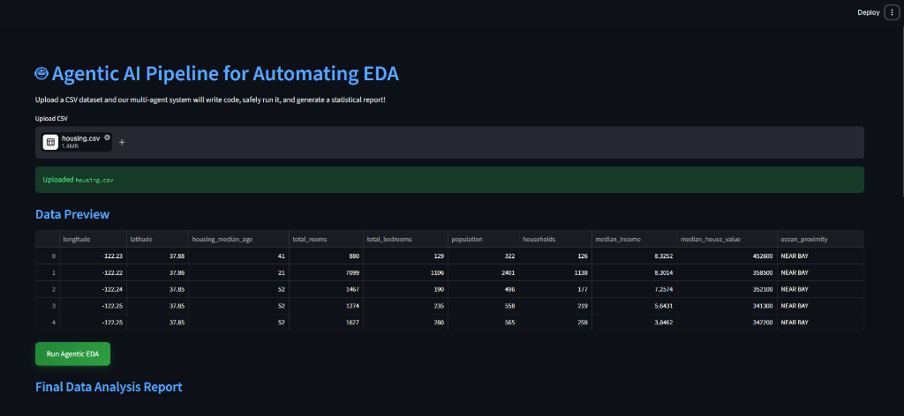
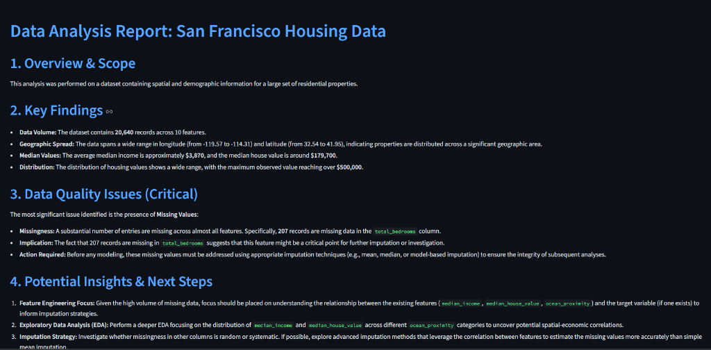

# 🤖 Agentic AI Pipeline to Automate EDA

A highly robust, multi-agent artificial intelligence pipeline that automates Exploratory Data Analysis (EDA). Built with **LangGraph**, **LangChain**, and **Streamlit**, this project dynamically generates, executes, and analyzes Python Pandas code to produce comprehensive statistical reports from any CSV dataset you provide.

---

## ✨ Key Features

- **Multi-Agent Workflow:** Utilizes a state-graph system to break down the EDA process into specialized AI roles (Coding, Executing, Interpreting).
- **Self-Healing Code:** If the generated analysis code fails during execution (e.g., a `KeyError`), the error stack trace is automatically routed back to the Coding Agent to fix the script and try again.
- **Isolated Execution Sandbox:** Automatically creates a restricted `sandbox/` directory to run the LLM-generated code safely. Uses a tight timeout and stripped environment variables to prevent infinite loops or system access.
- **Premium Web UI:** Includes a beautiful, dark-mode Streamlit frontend with drag-and-drop CSV uploads, live progress tracking, and interactive expandable sections.
- **Local LLM Support:** Fully configured to run 100% locally and privately using an LM Studio server.

---

### 📸 App Preview





---

## 🏗️ Architecture

The pipeline uses `LangGraph` to manage the state between three core agents:

1. **Coding Agent (`coder`)**: Reads the dataset schema and uses an LLM to generate a Python script using Pandas for data analysis.
2. **Execution Agent (`executor`)**: Places the dataset and code into the isolated `sandbox/` folder. It runs the code using `subprocess.run()`. It intercepts `stdout` on success, or captures `stderr` and bounces back to the Coding Agent if it fails.
3. **Interpreting Agent (`interpreter`)**: Takes the raw terminal output from the successful script execution and writes a professional, human-readable Markdown report detailing trends, anomalies, and data quality issues.

---

## 🚀 Getting Started

### Prerequisites
- Python 3.9+
- [LM Studio](https://lmstudio.ai/) (or a compatible local OpenAI drop-in server)

### 1. Setup the Environment
First, clone the repository and set up a virtual environment:
```bash
python -m venv .venv
# Activate on Windows
.venv\Scripts\activate
# Activate on Mac/Linux
source .venv/bin/activate
```

### 2. Install Dependencies
Install the required Python packages:
```bash
pip install -r requirements.txt
```
*(Core packages include: `pandas`, `streamlit`, `langchain`, `langchain-openai`, `langgraph`)*

### 3. Start your Local LLM
Open **LM Studio**, load your preferred model (e.g., Llama-3, Gemma), and start the Local Inference Server. Ensure it is running on the default port:
```text
http://localhost:1234/v1
```

### 4. Launch the Web Application
Start the Streamlit frontend:
```bash
streamlit run app.py
```
A browser window will automatically open to `http://localhost:8501`.

---

## 🔑 Using External API Keys (e.g., OpenRouter)

If you prefer to use an external cloud LLM provider like OpenRouter instead of LM Studio, you can easily modify the `get_llm()` function inside `app.py`.

Replace the existing `get_llm()` function with the following:

```python
import os
from langchain_openai import OpenAI

@st.cache_resource
def get_llm():
    return OpenAI(
        base_url="https://openrouter.ai/api/v1", 
        # It's best practice to use an environment variable for your key
        api_key=os.environ.get("OPENROUTER_API_KEY", "your-openrouter-api-key-here"), 
        model="meta-llama/llama-3-8b-instruct:free",  # <-- OpenRouter requires a model ID
        temperature=0.2,
        max_tokens=2048
    )
```

Make sure to set your `OPENROUTER_API_KEY` as an environment variable before running the app.

---

## 💡 How to Use
1. Open the web interface.
2. Drag and drop any `.csv` file into the upload zone.
3. Verify the data in the dynamic preview pane.
4. Click **Run Agentic EDA**.
5. Sit back and watch as the agents code, debug, and write your final Data Analysis Report! You can inspect the generated Python code and raw execution outputs in the expanders at the bottom of the page.
